# Отчёт

## Part 1. Инструмент ipcalc

### 1.1. Сети и маски
- Определяем адрес сети **`ipcalc 192.167.38.54/13`**\
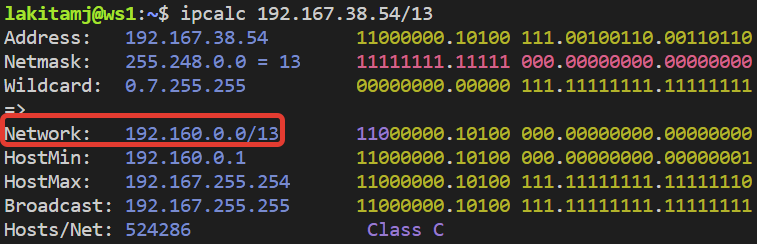
- перевод маски 255.255.255.0 в префиксную и двоичную запись\
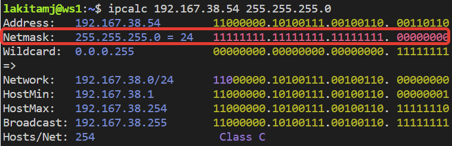
- перевод маски /15 в обычную и двоичную запись\
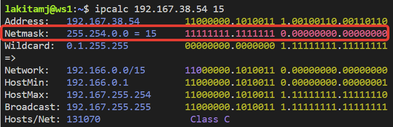
- перевод маски 11111111.11111111.11111111.11110000 в обычную и префиксную запись\
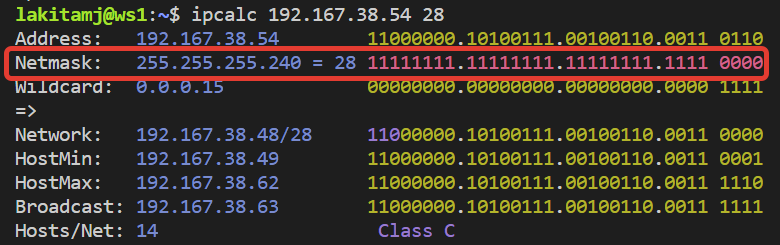
- минимальный и максимальный хост в сети 12.167.38.4 при маске /8\
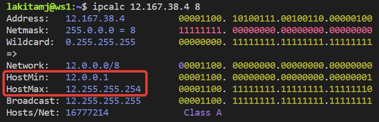
- минимальный и максимальный хост в сети 12.167.38.4 при маске 11111111.11111111.00000000.00000000\
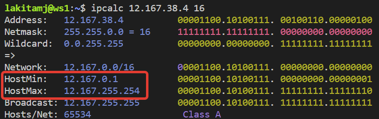
- минимальный и максимальный хост в сети 12.167.38.4 при маске 255.255.254.0\
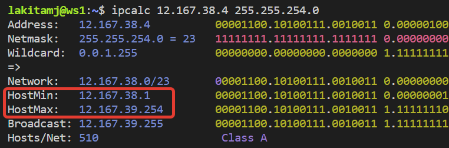
- минимальный и максимальный хост в сети 12.167.38.4 при маске /4\
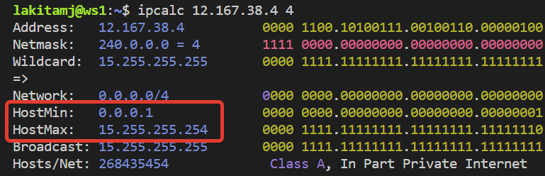

### 1.2. localhost
- Из вывода команды **`ping`** видно, что можно обратиться к **`localhost`** со следующими адресами:

| Адрес         | Можно обратиться |
| ------------- | ---------------- |
| 194.34.23.100 | -                |
| 127.0.0.2     | +                |
| 127.1.0.1     | +                |
| 128.0.0.1     | -                |

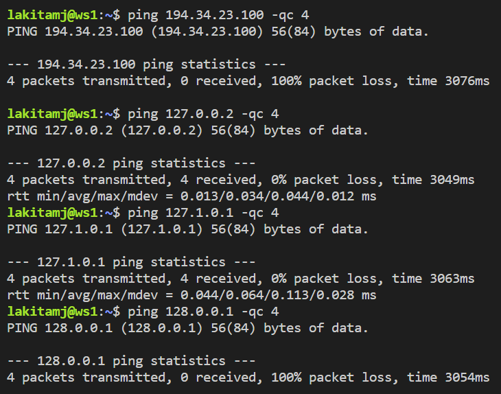

Также loopback-адреса отмечаются соответствующим тегом в выводе ipcalc\
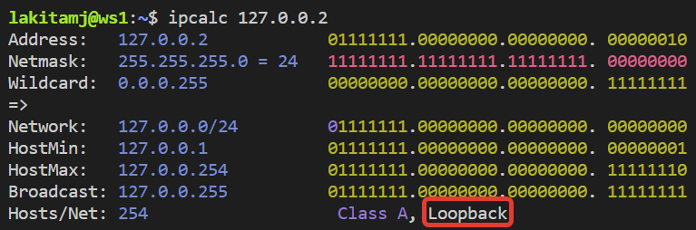

### 1.3. Диапазоны и сегменты сетей
-  Какие из перечисленных IP можно использовать в качестве публичного, а какие только в качестве частных: 

| Адрес          | Частный |
|----------------|---------|
| 10.0.0.45      |    +    |
| 134.43.0.2     |    -    |
| 192.168.4.2    |    +    |
| 172.20.250.4   |    +    |
| 172.0.2.1      |    -    |
| 192.172.0.1    |    -    |
| 172.68.0.2     |    -    |
| 172.16.255.255 |    +    |
| 10.10.10.10    |    +    |
| 192.169.168.1  |    -    |

Класс А: 10.0.0.0 – 10.255.255.255\
Класс Б: 172.16.0.0 – 172.31.255.255\
Класс С: 192.168.0.0 – 192.168.255.255

В выводе ipcalc приватные адреса помечаются тегом **`Private Internet`**\
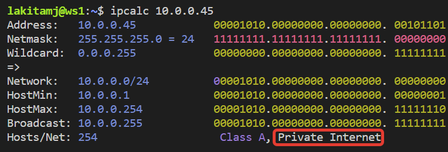

- какие из перечисленных IP адресов шлюза возможны у сети 10.10.0.0/18:

| Адрес       | Может быть шлюзом |
|-------------|-------------------|
| 10.0.0.1    |         -         |
| 10.10.0.2   |         +         |
| 10.10.10.10 |         +         |
| 10.10.100.1 |         -         |
| 10.10.1.255 |         +         |

Диапозон допустимых адесов для сети отображается в выводе **`ipcalc`**\
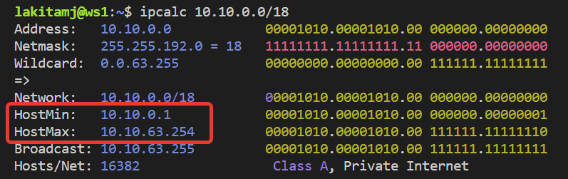

## Part 2. Статическая маршрутизация между двумя машинами

- С помощью команды **`ip a`** посмотреть существующие сетевые интерфейсы\
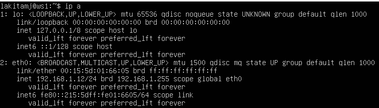\
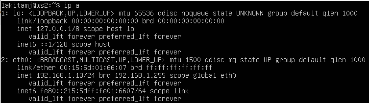
- Описать сетевой интерфейс, соответствующий внутренней сети, на обеих машинах и задать следующие адреса и маски: ws1 - 192.168.100.10, маска /16, ws2 - 172.24.116.8, маска /12\
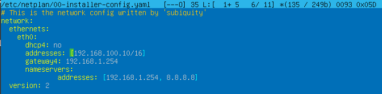\
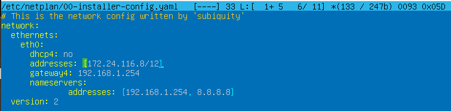
- Выполнить команду **`netplan apply`** для перезапуска сервиса сети\
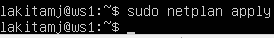\
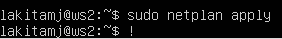

### 2.1. Добавление статического маршрута вручную

- Добавить статический маршрут от одной машины до другой и обратно при помощи команды вида **`ip r add`**\
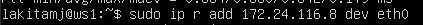\
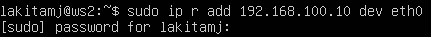
- Пропинговать соединение между машинами\
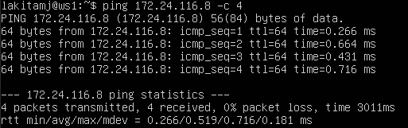\
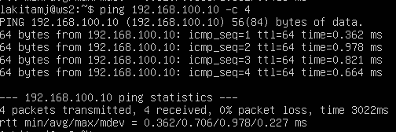

### 2.2. Добавление статического маршрута с сохранением

- Добавить статический маршрут от одной машины до другой с помощью файла **`etc/netplan/00-installer-config.yaml`**\
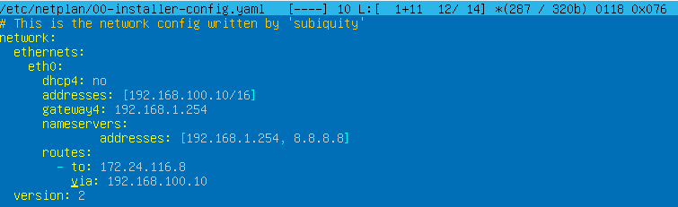\
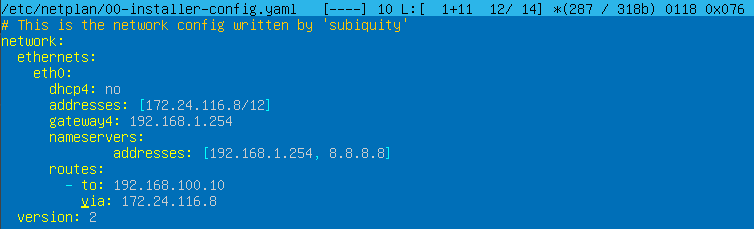
- Пропинговать соединение между машинами\
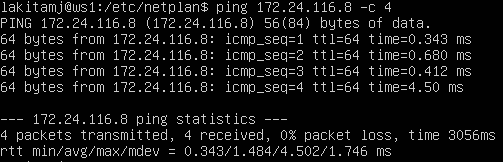\
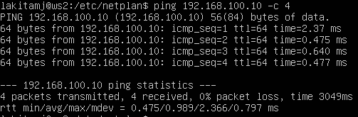

## Part 3. Утилита iperf3

### 3.1. Скорость соединения

- Перевести и записать в отчёт:\
8 Mbps в MB/s: 1 MB/s\
100 MB/s в Kbps: 819200 Kbps\
1 Gbps в Mbps: 1024 Mbps\

### 3.2. Утилита iperf3

- Измерить скорость соединения между ws1 и ws2\
На сервере выполняем команду **`iperf3 -s`**\
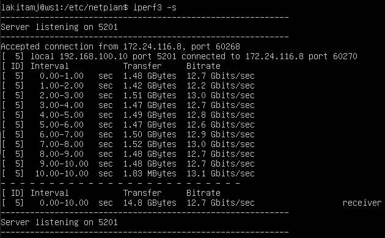\
С клиента подключаемся к серверу командой **`iperf3 -c 192.168.100.10`**\
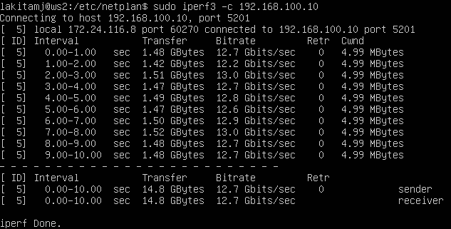

## Part 4. Сетевой экран

### 4.1. Утилита iptables

Создать файл /etc/firewall.sh, имитирующий фаерволл, на ws1 и ws2:

Нужно добавить в файл подряд следующие правила:

- на ws1 применить стратегию когда в начале пишется запрещающее правило, а в конце пишется разрешающее правило (это касается пунктов 4 и 5)

- на ws2 применить стратегию когда в начале пишется разрешающее правило, а в конце пишется запрещающее правило (это касается пунктов 4 и 5)

- открыть на машинах доступ для порта 22 (ssh) и порта 80 (http)

- запретить echo reply (машина не должна "пинговаться”, т.е. должна быть блокировка на OUTPUT)

- разрешить echo reply (машина должна "пинговаться")

- Скрин с содержанием файла **`/etc/firewall.sh`** на **`ws1`**\
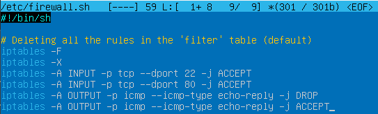
- Скрин с содержанием файла **`/etc/firewall.sh`** на **`ws2`**\
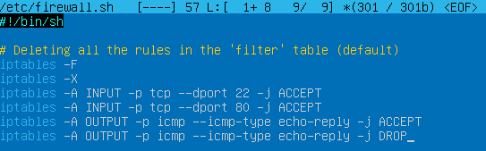

- Запустить файлы на **`ws1`** командами **`chmod +x /etc/firewall.sh`** и **`/etc/firewall.sh`**, выводим **`iptables`** и пингуем **`ws2`**\
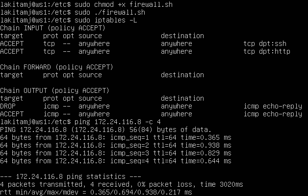\
- Запустить файлы на **`ws2`** командами **`chmod +x /etc/firewall.sh`** и **`/etc/firewall.sh`**, выводим **`iptables`** и пингуем **`ws1`**\

Разница между примененными стратегиями заключается в том, что, как видно из скринов, **`ws1`** не отвечает на пинг. Таким образом, можно сделать вывод, что применяется первое подходящее правило, а все последующие игнорируются.

### 4.2. Утилита nmap

- Командой ping найти машину, которая не "пингуется", после чего утилитой nmap показать, что хост машины запущен
- Проверка: в выводе nmap сказано: Host is up\

## Part 5. Статическая маршрутизация сети

Поднять пять виртуальных машин (3 рабочие станции (ws11, ws21, ws22) и 2 роутера (r1, r2)) согласно схеме:

### 5.1. Настройка адресов машин

Файл **`etc/netplan/00-installer-config.yaml`** на **`r1`**\
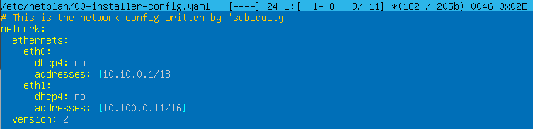\
Файл **`etc/netplan/00-installer-config.yaml`** на **`r2`**\
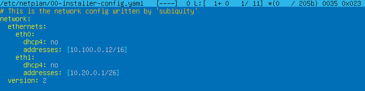\
Файл **`etc/netplan/00-installer-config.yaml`** на **`ws11`**\
\
Файл **`etc/netplan/00-installer-config.yaml`** на **`ws21`**\
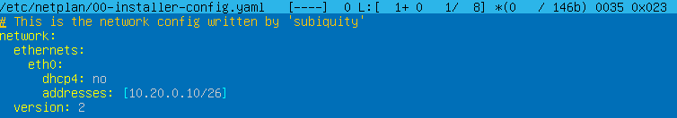\
Файл **`etc/netplan/00-installer-config.yaml`** на **`ws22`**\
\
Командой **`ip -4 a`** проверяем, что адрес машины задан верно на **`r1`**\
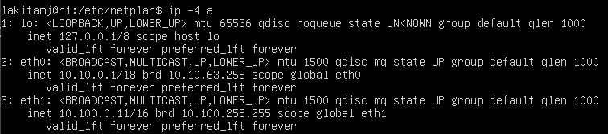\
Командой **`ip -4 a`** проверяем, что адрес машины задан верно на **`r2`**\
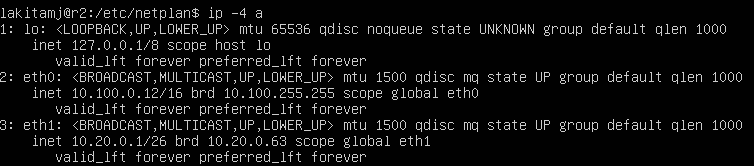\
Командой **`ip -4 a`** проверяем, что адрес машины задан верно на **`ws11`**, а также пингуем **`r1`**\
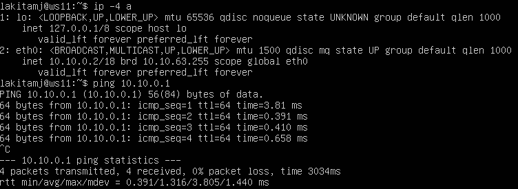\
Командой **`ip -4 a`** проверяем, что адрес машины задан верно на **`ws21`**, а также пингуем **`ws22`**\
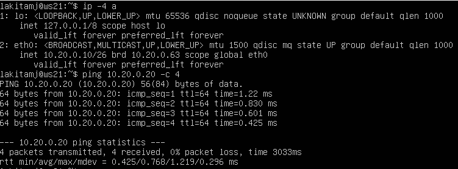\
Командой **`ip -4 a`** проверяем, что адрес машины задан верно на **`ws22`**\
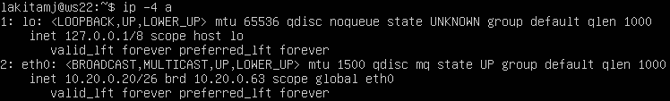

### 5.2. Включение переадресации IP-адресов.

- Для включения переадресации IP, выполняем команду на роутерах: **`sysctl -w net.ipv4.ip_forward=1`**. При таком подходе переадресация не будет работать после перезагрузки системы.\
На роутере **`r1`**\
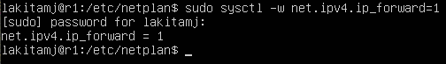\
На роутере **`r2`**\
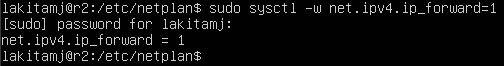

- Откройте файл /etc/sysctl.conf и добавьте в него следующую строку: **`net.ipv4.ip_forward = 1`**. При использовании этого подхода, IP-переадресация включена на постоянной основе.\
На роутере **`r1`**\
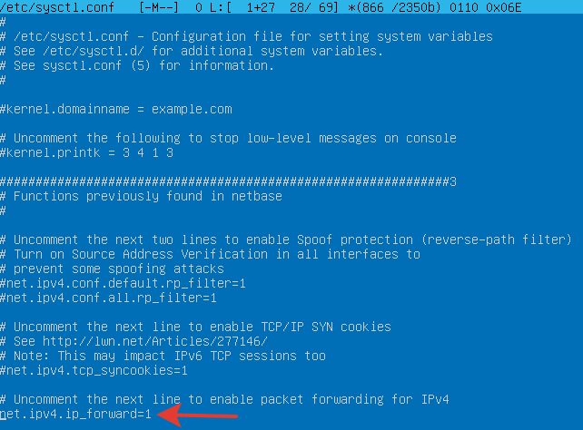\
На роутере **`r2`**\
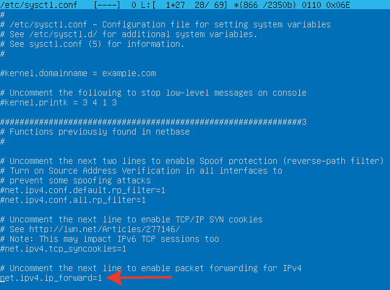

### 5.3. Установка маршрута по-умолчанию

- Настроить маршрут по-умолчанию (шлюз) для рабочих станций. Для этого добавить default перед IP роутера в файле конфигураций.\
Файл **`netplan/00-installer-config.yaml`** на **`ws11`**\
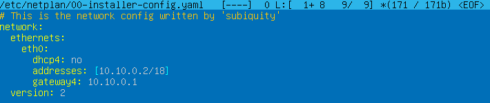\
Файл **`netplan/00-installer-config.yaml`** на **`ws21`**\
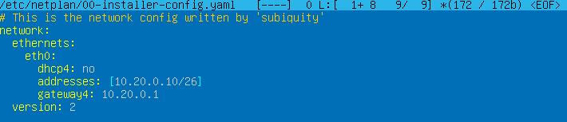\
Файл **`netplan/00-installer-config.yaml`** на **`ws22`**\
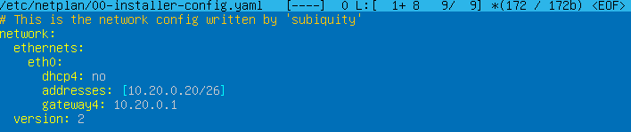

- Вызвать **`ip r`** и показать, что добавился маршрут в таблицу маршрутизации.\
Вывод **`ip r`** на **`ws11`**\
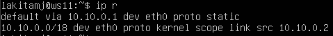\
Вывод **`ip r`** на **`ws21`**\
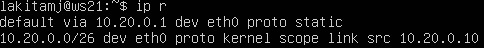\
Вывод **`ip r`** на **`ws22`**\
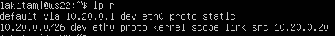

- Пропинговать с ws11 роутер r2 и показать на r2, что пинг доходит. Для этого использовать команду: **`tcpdump -tn -i eth0`**.\
Вывод **`ping 10.100.0.12`** на **`ws11`**\
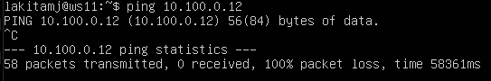\
Вывод **`tcpdump -tn -i eth0`** на **`r2`**\

### 5.4. Добавление статических маршрутов

- Добавить в роутеры r1 и r2 статические маршруты в файле конфигураций.\
Файл **`netplan/00-installer-config.yaml`** на **`r1`**\
\
Файл **`netplan/00-installer-config.yaml`** на **`r2`**\

- Вызвать ip r и показать таблицы с маршрутами на обоих роутерах.\
Вывод **`ip r`** на **`r1`**\
\
Вывод **`ip r`** на **`r2`**\

- Запустить команды на ws11: ip r list 10.10.0.0/[маска сети] и ip r list 0.0.0.0/0\

В случае если подходит несколько маршрутов, выбирается маршрут с самой длинной маской.

### 5.5. Построение списка маршрутизаторов

- Запустить на **`r1`** команду дампа: **`tcpdump -tnv -i eth0`**\

- При помощи утилиты **`traceroute`** построить список маршрутизаторов на пути от **`ws11`** до **`ws21`**\

Каждый пакет проходит на своем пути определенное количество узлов, пока достигнет своей цели. Причем, каждый пакет имеет свое время жизни. Это количество узлов, которые может пройти пакет перед тем, как он будет уничтожен. Этот параметр записывается в заголовке TTL, каждый маршрутизатор, через который будет проходить пакет уменьшает его на единицу. При TTL=0 пакет уничтожается, а отправителю отсылается сообщение Time Exceeded.

Команда traceroute linux использует UDP пакеты. Она отправляет пакет с TTL=1 и смотрит адрес ответившего узла, дальше TTL=2, TTL=3 и так пока не достигнет цели. Каждый раз отправляется по три пакета и для каждого из них измеряется время прохождения. Пакет отправляется на случайный порт, который, скорее всего, не занят. Когда утилита traceroute получает сообщение от целевого узла о том, что порт недоступен трассировка считается завершенной.

### 5.6. Использование протокола ICMP при маршрутизации

- Запустить на r1 перехват сетевого трафика, проходящего через eth0 с помощью команды: **`tcpdump -n -i eth0 icmp`**\

- Пропинговать с ws11 несуществующий IP (например, 10.30.0.111) с помощью команды: **`ping -c 1 10.30.0.111`**\

## Part 6. Динамическая настройка IP с помощью DHCP

Для **`r2`** настроить в файле **`/etc/dhcp/dhcpd.conf`** конфигурацию службы DHCP:
- Устанавливаем DHCP-сервер командой **`sudo apt install isc-dhcp-server`**.
- указать адрес маршрутизатора по-умолчанию, DNS-сервер и адрес внутренней сети:\

- в файле **`resolv.conf`** прописать nameserver 8.8.8.8.\

- Перезагрузить службу **`DHCP`** командой **`systemctl restart isc-dhcp-server`**. Машину **`ws21`** перезагрузить при помощи **`reboot`** и через **`ip a`** показать, что она получила адрес. Также пропинговать **`ws22`** с **`ws21`**.\
Перезапускаем слжбу **`DHCP`**\
\
Редактируем настроки\
\
Проверяем с помощью **`ip a`**\
\
Пингуем **`ws22`**\

- Указать MAC адрес у ws11, для этого в etc/netplan/00-installer-config.yaml надо добавить строки: macaddress: 10:10:10:10:10:BA, dhcp4: true\

- Для r1 настроить аналогично r2, но сделать выдачу адресов с жесткой привязкой к MAC-адресу (ws11). Провести аналогичные тесты.\
Редактируем файл **`resolv.conf`**\
\
Проверяем с помощью **`ip a`**\
\
Пингуем **`ws21`**\

- Запросить с **ws22** обновление ip адреса.\
Обновляем ip адрес командой **`sudo dhclient -r; sudo dhclient`**, затем проверяем изменение командой **`ip a`**

## Part 7. NAT

- В файле **`/etc/apache2/ports.conf`** на **`ws22`** и **`r1`** изменить строку **`Listen 80`** на **`Listen 0.0.0.0:80`**, то есть сделать сервер **`Apache2`** общедоступным.\
Файл **`ports.conf`** на **`ws22`**\
\
Файл **`ports.conf`** на **`r1`**\

- Запустить веб-сервер Apache командой **`service apache2 start`** на **`ws22`** и **`r1`**.\
Запуск **`Apache2`** на **`ws22`**\
\
Запуск **`Apache2`** на **`r1`**\

Добавить в фаервол, созданный по аналогии с фаерволом из Части 4, на **`r2`** следующие правила:
- удаление правил в таблице filter - **`iptables -F`**
- удаление правил в таблице "NAT" - **`iptables -F -t nat`**
- отбрасывать все маршрутизируемые пакеты - **`iptables --policy FORWARD DROP`**\

- Запускать файл также, как в Части 4\

- Проверить соединение между **`ws22`** и **`r1`** командой **`ping`**
- При запуске файла с этими правилами, **`ws22`** не должна "пинговаться" с **`r1`**\

Добавить в файл ещё одно правило:
- разрешить маршрутизацию всех пакетов протокола **`ICMP`**\

- Запускать файл также, как в Части 4\

- Проверить соединение между **`ws22`** и **`r1`** командой **`ping`**
- При запуске файла с этими правилами, **`ws22`** должна "пинговаться" с **`r1`**\

Добавить в файл ещё два правила:

- включить **`SNAT`**, а именно маскирование всех локальных ip из локальной сети, находящейся за **`r2`** (по обозначениям из Части 5 - сеть 10.20.0.0. Совет: стоит подумать о маршрутизации внутренних пакетов, а также внешних пакетов с установленным соединением
- включить **`DNAT`** на **`8080`** порт машины **`r2`** и добавить к веб-серверу **`Apache`**, запущенному на **`ws22`**, доступ извне сети. Совет: стоит учесть, что при попытке подключения возникнет новое tcp-соединение, предназначенное **`ws22`** и **`80`** порту\

- Запускать файл также, как в Части 4. Перед тестированием рекомендуется отключить сетевой интерфейс NAT (его наличие можно проверить командой ip a) в VirtualBox, если он включен

- Проверить соединение по TCP для SNAT, для этого с **`ws22`** подключиться к серверу Apache на **`r1`** командой: **`telnet 10.100.0.11 80`**\

- Проверить соединение по TCP для DNAT, для этого с **`r1`** подключиться к серверу Apache на **`ws22`** командой **`telnet`** (обращаться по адресу **`r2`** и порту **`8080`**)\

## Part 8. Дополнительно. Знакомство с SSH Tunnels

- Запустить на **`r2`** фаервол с правилами из Части 7\
\

- Запустить веб-сервер **`Apache`** на **`ws22`** только на **`localhost`** (то есть в файле **`/etc/apache2/ports.conf`** изменить строку **`Listen 80`** на **`Listen localhost:80`**)\

- Воспользоваться **`Local TCP forwarding`** с **`ws21`** до **`ws22`**, чтобы получить доступ к веб-серверу на **`ws22`** с **`ws21`**\

- Воспользоваться **`Remote TCP forwarding`** c **`ws11`** до **`ws22`**, чтобы получить доступ к веб-серверу на **`ws22`** с **`ws11`**\

- Для проверки, сработало ли подключение в обоих предыдущих пунктах, перейдите во второй терминал (например, клавишами **`Alt + F2`**) и выполните команду: **`telnet 127.0.0.1 [локальный порт]`**\
Проверяем подключение на **`ws21`**\
\
Проверяем подключение на **`ws11`**\

